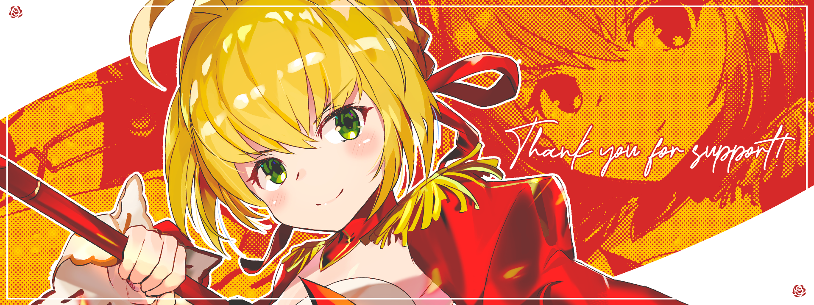

<h2 style="font-family: 'Roboto', sans-serif; background: linear-gradient(to right, #FF6B6B, #4ECDC4); -webkit-background-clip: text; -webkit-text-fill-color: transparent;">🦌 Shikanokonokonoko Koshitantan 🦌</h2>

  <strong>🐾 I, Respire, Like the Manga Series "MY Deer Friend Nokotan"! 🦌</strong>

  Picture this: a whirlwind of giggles and glitter, where Noko-tan and her wacky crew are up to their usual shenanigans! I’m diving headfirst into this delightful chaos, inhaling the sweet scent of absurdity like it’s the finest perfume! Every twist and turn is like a banana peel waiting to trip you into a pool of jellybeans! So, let’s throw caution to the wind, unleash our inner goofballs, and dance like nobody's watching—just like Torako, who’s trying to figure out her new, zany life with Noko-tan by her side! 

 

  

<h2 style="font-family: 'Verdana', sans-serif; color: #FF5733; text-shadow: 2px 2px 0px black;">👋 Anyway, Hi!</h2>

  <strong>https://respy.tech | https://rimunace.xyz | https://respire.my</strong>

  
   

  
   
  
   
  
   
  

<h2 style="font-family: 'Verdana', sans-serif; color: #FF5733; text-shadow: 2px 2px 0px black;">🚀 About Me</h2>

You probably have read what I written above. You don't need to **KNOW** more about me. You want to? Is it worth it? You think it's worth it? You really sure? Are you really really sure? For real real sure, real?

Fine, fine, fine. I'm not saying anything. I'm just saying that you probably have read what I written above. You don't need to **KNOW** more about me. You want to? Is it worth it? You think it's worth it? You really sure? Are you really really sure? For real real sure, real?

  <h2 style="font-family: 'Verdana', sans-serif; color: #FF5733; text-shadow: 2px 2px 0px black;">💻 Programming Language</h2>
  

    
    
    
  

<h2 style="font-family: 'Verdana', sans-serif; color: #FF5733; text-shadow: 2px 2px 0px black;">📫 Get in Touch</h2>

Feel free to reach out to me via [email](mailto:contact@respy.tech) or connect with me on [Discord](https://discordapp.com/users/188610034849021952).

 

