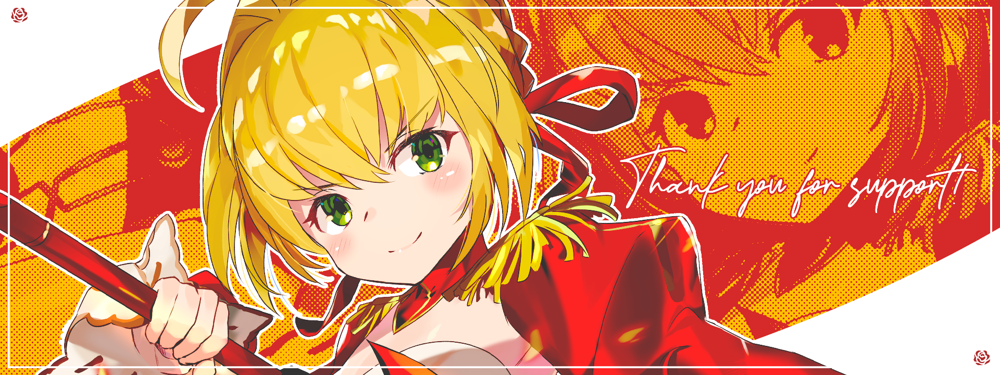

<h2 style="font-family: 'Verdana', sans-serif; color: #FF5733; text-shadow: 2px 2px 0px black;">👋 Anyway, Hi!</h2>

   
  

  <h2 style="font-family: 'Verdana', sans-serif; color: #FF5733; text-shadow: 2px 2px 0px black;">🌐 My Websites</h2>
  
  <table align="center" border="0" cellspacing="0" cellpadding="0">
    <tr>
      <td align="center" width="150">
        
      </td>
      <td align="center" width="150">
        
      </td>
      <td align="center" width="150">
        
      </td>
      <td align="center" width="150">
        
      </td>
    </tr>
    <tr>
      <td align="center"><a href="https://respy.tech">respy.tech</a></td>
      <td align="center"><a href="https://respire.my">respire.my</a></td>
      <td align="center"><a href="https://bepasted.com">bepasted.com</a></td>
      <td align="center"><a href="https://api.rimunace.xyz">api.rimunace.xyz</a></td>
    </tr>
    <tr>
      <td align="center">My Org's Website</td>
      <td align="center">My Profile Page</td>
      <td align="center">Text & Code Sharing</td>
      <td align="center">AI API Service</td>
    </tr>
  </table>

<h2 style="font-family: 'Verdana', sans-serif; color: #FF5733; text-shadow: 2px 2px 0px black;">🚀 About Me</h2>

Just a loop. You don't need to **KNOW** more about me. You want to? Is it worth it? You think it's worth it? You really sure? Are you really really sure? For real real sure, real?

Fine, fine, fine. I'm not saying anything. I'm just saying that you probably have read what I written above. You don't need to **KNOW** more about me. You want to? Is it worth it? You think it's worth it? You really sure? Are you really really sure? For real real sure, real?

  <h2 style="font-family: 'Verdana', sans-serif; color: #FF5733; text-shadow: 2px 2px 0px black;">💻 Programming Language</h2>
  

    
    
    
    
  

<h2 style="font-family: 'Verdana', sans-serif; color: #FF5733; text-shadow: 2px 2px 0px black;">📫 Get in Touch</h2>

Feel free to reach out to me via [email](mailto:hi@respire.my) (hi@respire.my) or connect with me on [Discord](https://discordapp.com/users/188610034849021952).

 

