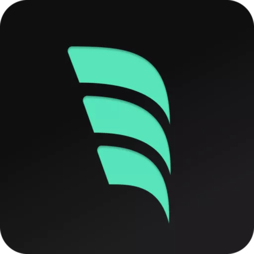
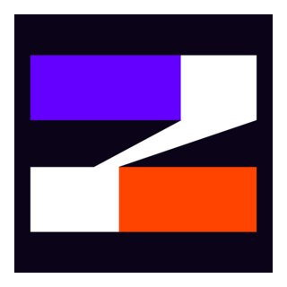
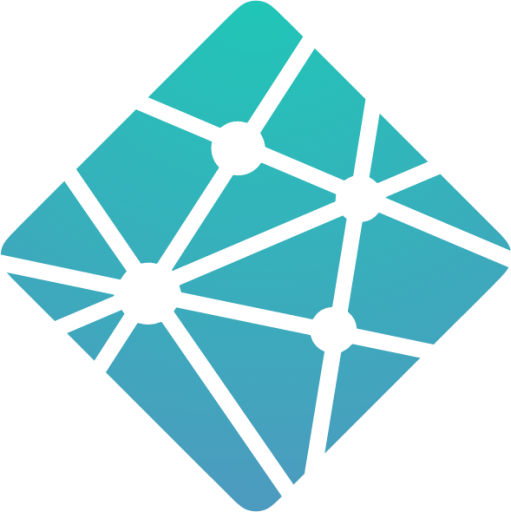

### ✦━━━━・𝐂𝐑𝐄𝐃𝐈𝐓𝐒・━━━━✦
- Profile Picture: [冒険者 C](https://www.pixiv.net/en/users/29874909)
- Partner & Friend | GFX Artist | Banner: [Iyouka](https://x.com/iyouka_)

### ✦━━━━・𝐓𝐎𝐎𝐋𝐒・━━━━✦
-  [Cursor IDE](https://cursor.com/)
-  [Windsurf IDE](https://codeium.com/windsur)
-  [Sublime Text](https://www.sublimetext.com)
-  [v0.dev](https://v0.dev)

### ✦━━━━・𝐏𝐋𝐀𝐓𝐅𝐎𝐑𝐌𝐒 & 𝐒𝐄𝐑𝐕𝐈𝐂𝐄𝐒・━━━━✦

> [!NOTE]
> These link may contain affiliate links!
-  [Zeabur](https://zeabur.com/referral?referralCode=RimunAce)
-  [BunnyCDN](https://bunny.net?ref=rzy2b8uzof)
-  [Cloudflare](https://www.cloudflare.com/)
-  [Netlify](https://www.netlify.com/)
-  [Vercel](https://vercel.com/)

~~I can't list them all. Otherwise this list will be too long lmfao~~

### ✦━━━━・𝐂𝐎𝐍𝐓𝐀𝐂𝐓・━━━━✦
- Email: hi@respire.my
- Discord: respire (188610034849021952) [This is my ID]
- Visit My Profile: https://respire.my

<h2 style="text-shadow: 2px 2px 0px black;">For Nerds</h2>

I swear you do not want to open this sorry excuse of README design

Absolute Cinema

    

        
        
    

 

